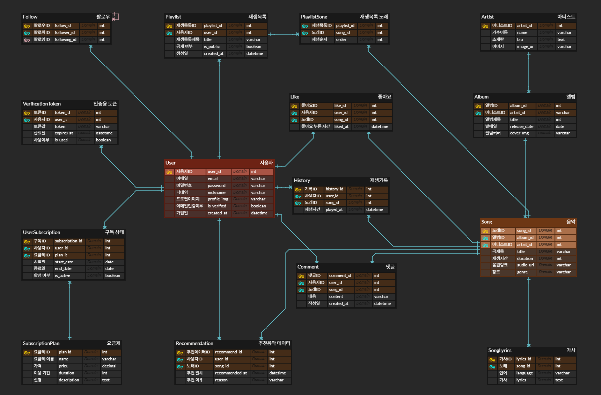

# 🎵 Music Platform Project

음악 스트리밍 및 플레이리스트 관리 플랫폼입니다. Spring Boot 백엔드와 React 프론트엔드로 구성된 풀스택 웹 애플리케이션입니다.

## 👥 팀원

- **김윤범** - 팀장, 프로젝트 총괄, SpringBoot 기반 서버 구축, 코드 통합 관리
- **이정민** - 팀원, 스트리밍 플레이어 설계 및 개발, 통계/조회 기능
- **김지훈** - 팀원, MySQL 기반 ERD 테이블 설계, DB 설계 및 관리

## 📋 프로젝트 개요

이 프로젝트는 사용자들이 음악을 검색하고, 플레이리스트를 생성/관리하며, 다른 사용자들과 음악을 공유할 수 있는 종합적인 음악 플랫폼입니다.

### 주요 기능

- 🎵 **음악 검색 및 재생**: 다양한 음악 검색 및 스트리밍
- 📝 **플레이리스트 관리**: 개인 플레이리스트 생성, 편집, 삭제
- 👥 **소셜 기능**: 좋아요, 댓글, 공유 기능
- 🔐 **사용자 인증**: JWT 기반 로그인/회원가입
- 📊 **추천 시스템**: 개인화된 음악 추천
- 📱 **반응형 UI**: 모바일 및 데스크톱 지원

## 🏗️ 프로젝트 구조

```
250728_02_test/
├── music/                 # Spring Boot 백엔드
│   ├── src/main/java/com/music/
│   │   ├── common/        # 공통 설정 (Security, JWT, Swagger)
│   │   ├── music/         # 음악 관련 엔티티 및 서비스
│   │   ├── playlist/      # 플레이리스트 관리
│   │   ├── user/          # 사용자 관리
│   │   ├── interaction/   # 좋아요, 댓글 등 상호작용
│   │   └── recommendation/ # 추천 시스템
│   ├── build.gradle       # Gradle 빌드 설정
│   └── ...
└── music_frontend/        # React 프론트엔드
    ├── src/
    │   ├── components/    # 재사용 가능한 컴포넌트
    │   ├── pages/         # 페이지 컴포넌트
    │   ├── context/       # React Context (인증 등)
    │   ├── api/           # API 호출 함수
    │   └── styles/        # 스타일 파일
    ├── package.json       # npm 의존성 관리
    └── ...
```

## ERD 테이블


## 🛠️ 기술 스택

### 백엔드 (Spring Boot)
- **Framework**: Spring Boot 3.5.3
- **Language**: Java 17
- **Database**: MySQL
- **Security**: Spring Security + JWT
- **Documentation**: Swagger/OpenAPI 3
- **Build Tool**: Gradle

### 프론트엔드 (React)
- **Framework**: React 19.1.0
- **Build Tool**: Vite
- **Styling**: Tailwind CSS
- **Routing**: React Router DOM
- **HTTP Client**: Axios
- **Animation**: Framer Motion
- **Payment**: TossPayments SDK

## 🚀 설치 및 실행

### 사전 요구사항
- Java 17 이상
- Node.js 18 이상
- MySQL 8.0 이상

### 백엔드 실행

1. **프로젝트 클론 및 디렉토리 이동**
   ```bash
   cd music
   ```

2. **MySQL 데이터베이스 설정**
   - MySQL 서버 실행
   - 데이터베이스 생성
   ```sql
   CREATE DATABASE music_platform;
   ```

3. **애플리케이션 실행**
   ```bash
   ./gradlew bootRun
   ```

4. **API 문서 확인**
   - Swagger UI: http://localhost:8080/swagger-ui.html

### 프론트엔드 실행

1. **디렉토리 이동**
   ```bash
   cd music_frontend
   ```

2. **의존성 설치**
   ```bash
   npm install
   ```

3. **개발 서버 실행**
   ```bash
   npm run dev
   ```

4. **애플리케이션 접속**
   - 브라우저에서 http://localhost:5173 접속

## 📡 API 엔드포인트


### 음악
- `GET /api/songs` - 음악 목록 조회
- `GET /api/songs/{id}` - 특정 음악 조회
- `GET /api/songs/search` - 음악 검색

### 플레이리스트
- `GET /api/playlists` - 플레이리스트 목록
- `POST /api/playlists` - 플레이리스트 생성
- `PUT /api/playlists/{id}` - 플레이리스트 수정
- `DELETE /api/playlists/{id}` - 플레이리스트 삭제

### 추천
- `GET /api/recommendations` - 개인화된 음악 추천

## 🔧 환경 설정

### 백엔드 설정 (application.properties)
```properties
# 데이터베이스 설정
spring.datasource.url=jdbc:mysql://localhost:3306/music_platform
spring.datasource.username=your_username
spring.datasource.password=your_password

# JWT 설정
jwt.secret=your_jwt_secret_key
jwt.expiration=86400000
```

### 프론트엔드 설정 (.env)
```env
VITE_API_BASE_URL=http://localhost:8080/api
```

## 🧪 테스트

### 백엔드 테스트
```bash
cd music
./gradlew test
```

### 프론트엔드 테스트
```bash
cd music_frontend
npm run test
```

## 📦 빌드 및 배포

### 백엔드 빌드
```bash
cd music
./gradlew build
```

### 프론트엔드 빌드
```bash
cd music_frontend
npm run build
```


